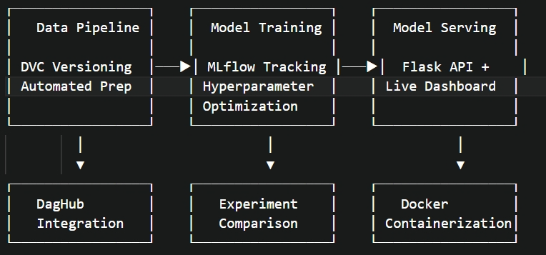

# 🚀 Reproducible Machine Learning Pipeline with Real-Time Serving

## 🎯 Project Overview

**Solving the ML Reproducibility Crisis**

Built to explore and solve real ML engineering challenges. This project demonstrates how modern MLOps tools can transform chaotic ML workflows into professional, reproducible systems with production-ready model serving.

**Problem Solved:** *"It works on my machine"* → *"It works everywhere, reliably"*

**Tools**: DVC, MLflow, DagHub, Docker, Flask, Scikit-learn  
**Dataset**: Pima Indians Diabetes Database

## 🏗️ Architecture Overview

```
┌─────────────────┐    ┌─────────────────┐    ┌─────────────────┐
│   Data Pipeline │    │  Model Training │    │  Model Serving  │
│                 │    │                 │    │                 │
│ DVC Versioning  │───▶│ MLflow Tracking │───▶│  Flask API +    │
│ Automated Prep  │    │ Hyperparameter  │    │ Live Dashboard  │
│                 │    │ Optimization    │    │                 │
└─────────────────┘    └─────────────────┘    └─────────────────┘
         │                       │                       │
         ▼                       ▼                       ▼
┌─────────────────┐    ┌─────────────────┐    ┌─────────────────┐
│   DagHub        │    │   Experiment    │    │   Docker        │
│   Integration   │    │   Comparison    │    │ Containerization│
└─────────────────┘    └─────────────────┘    └─────────────────┘
```

**Complete MLOps workflow from raw data to production-ready API endpoint.**



## 📁 Project Structure

```
ML_Pipeline/
├── 📁 .dvc/                          # DVC configuration and cache
├── 📊 Data/                          # Dataset storage
├── 📷 img/                           # Images and screenshots
├── 🧠 models/                        # Trained models and artifacts
├── 🌐 serve/                         # Model serving components
├── 📜 src/                           # Source code
├── 🧪 tests/                         # Testing suite
├── 🐍 venv/                          # Virtual environment
├── 🐳 .dockerignore                  # Docker ignore rules
├── 🔒 .env                           # Environment variables (MLflow credentials)
├── 📋 .gitignore                     # Git ignore rules
├── 🐳 Dockerfile                     # Main pipeline container
├── 🔒 dvc.lock                       # DVC lock file
├── 📄 dvc.yaml                       # Pipeline definition
├── 📄 params.yaml                    # Hyperparameters & settings
├── 📄 README.md                      # This documentation
└── 📄 requirements.txt               # Python dependencies
```


## 🚀 Quick Start

### **Prerequisites**
- Docker installed
- Git repository access
- Python 3.10+ (for local development)

### **1. Clone and Setup**
```bash
git clone https://github.com/fitsblb/ML_Pipeline.git
cd ML_Pipeline

# Create environment file
echo "MLFLOW_TRACKING_URI=https://dagshub.com/fitsblb/ML_Pipeline.mlflow" > .env
echo "MLFLOW_TRACKING_USERNAME=your_username" >> .env
echo "MLFLOW_TRACKING_PASSWORD=your_token" >> .env
```

### **2. Run Complete Pipeline**
```bash
# Build and run the ML pipeline
docker build -t ml-pipeline .
docker run --rm -v %cd%:/app --env-file .env ml-pipeline
```

### **3. Deploy Model Server**
```bash
# Build serving container
docker build -t model-server -f serve/Dockerfile .

# Launch API server with live dashboard
docker run -p 8000:8000 model-server
```

### **4. Access Live Dashboard**
Open browser: **http://localhost:8000**


## 🧪 Testing the API

### **Health Check**
```bash
curl http://localhost:8000
# Response: "Model is ready to predict!"
```

### **Single Prediction**
```bash
curl -X POST http://localhost:8000/predict 
     -H "Content-Type: application/json" 
     -d '{
       "Pregnancies": 6,
       "Glucose": 148,
       "BloodPressure": 72,
       "SkinThickness": 35,
       "Insulin": 0,
       "BMI": 33.6,
       "DiabetesPedigreeFunction": 0.627,
       "Age": 50
     }'
```

**Response:**
```json
{"prediction": [1]}  // 1 = Diabetes Risk, 0 = No Diabetes
```

### **Multiple Test Cases**
```bash
# Run comprehensive testing
python tests/test_multiple.py
```


## 🛠️ Technical Stack

| Tool | Purpose | Why This Tool |
|------|---------|---------------|
| **DVC** | Data & Model Versioning | Git for data - track large files efficiently |
| **MLflow** | Experiment Tracking | Compare runs, track metrics, log models |
| **DagHub** | Remote Collaboration | GitHub for ML - share data and experiments |
| **Scikit-learn** | ML Framework | Random Forest with hyperparameter tuning |
| **Python** | Implementation | Pandas, YAML configuration, pickle serialization |

## ✨ Key Features

### 🔁 **Complete Reproducibility**
- One command reproduces entire pipeline
- Deterministic results with fixed random seeds
- Version-controlled data, code, and models

### 📊 **Smart Dependency Tracking**
- Automatic recomputation when dependencies change
- Skip unchanged stages for efficiency
- Clear visualization of pipeline dependencies

### 🎛️ **Configurable Parameters**
- Centralized configuration in `params.yaml`
- Easy experimentation with different settings
- Parameter versioning and tracking

### 🚀 **Experiment Management**
- Track all runs with MLflow
- Compare model performance across experiments
- Remote experiment sharing via DagHub

### 👥 **Team Collaboration**
- Shared data storage with DVC
- Reproducible environments
- Clear pipeline documentation

## 🔄 Pipeline Stages

### 1️⃣ **Preprocessing Stage**
```bash
python src/preprocess.py
```
- Loads raw diabetes dataset
- Handles missing values and outliers
- Feature scaling and engineering
- Outputs cleaned dataset

### 2️⃣ **Training Stage**
```bash
python src/train.py
```
- Hyperparameter tuning with GridSearchCV
- Random Forest model training
- MLflow experiment logging
- Model serialization

### 3️⃣ **Evaluation Stage**
```bash
python src/evaluate.py
```
- Model performance evaluation
- Metrics calculation and logging
- Results visualization

## 📊 Results

The pipeline achieves:
- **Accuracy**: ~85% on diabetes prediction
- **Reproducibility**: 100% identical results across runs
- **Efficiency**: Only recomputes changed stages
- **Scalability**: Easy to add new features or models

## 🔧 Experimentation

Modify parameters in `params.yaml` and rerun:

```yaml
train:
  random_state: 42
  hyperparameter_grid:
    n_estimators: [100, 200, 300]  # Try more trees
    max_depth: [5, 10, 15, null]   # Experiment with depth
    min_samples_split: [2, 5, 10]  # Adjust splitting
```

```bash
# Pipeline automatically detects parameter changes
dvc repro  # Only reruns affected stages
```

## 🎓 Key Learnings

### **Technical Insights:**
- DVC transforms chaotic data workflows into organized pipelines
- MLflow provides crucial experiment tracking for ML iterations
- Proper dependency management eliminates "works on my machine" issues
- Parameter externalization enables systematic experimentation

### **MLOps Best Practices:**
- Version control everything: data, code, models, and configurations
- Automate pipeline execution and dependency tracking
- Centralize experiment tracking for team collaboration
- Design for reproducibility from day one

### **Engineering Principles:**
- Separation of concerns: preprocessing, training, evaluation
- Configuration-driven development with `params.yaml`
- Fail-fast validation with proper error handling
- Documentation-as-code approach

## 🛡️ Production Considerations

This pipeline demonstrates production-ready practices:
- **Environment isolation** with `requirements.txt`
- **Credential management** with environment variables
- **Error handling** and logging throughout
- **Modular design** for easy maintenance and testing
- **CI/CD readiness** with single-command execution

## 🔮 Future Enhancements

- [ ] Add automated model validation
- [ ] Implement A/B testing framework
- [ ] Add data drift detection
- [ ] Create web API for model serving
- [ ] Add automated model retraining triggers

---

## 🙏 Acknowledgments

Built to explore and solve real ML engineering challenges. This project demonstrates how modern MLOps tools can transform chaotic ML workflows into professional, reproducible systems.

**Tools**: DVC, MLflow, DagHub, Scikit-learn  
**Dataset**: Pima Indians Diabetes Database

---

*"In ML, reproducibility isn't a nice-to-have—it's the foundation of trustworthy AI systems."*
